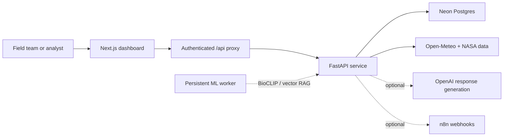

# CascadeAI

**AI-powered flood and biodiversity intelligence for Assam and West Bengal — live risk forecasting, species signals, and field-response tools.**

CascadeAI helps conservation teams turn environmental data into a clear, operational picture. It combines regional flood-risk forecasts with biodiversity context, then presents the results in an interactive map dashboard, response reports, and an assistant for field teams.

> CascadeAI is a decision-support tool. It does not replace local authorities, hydrological models, field verification, or emergency procedures.

## What it does

- Maps the latest flood-risk signal across 65 operational cells in Assam and West Bengal.
- Forecasts flood probability at 24-, 48-, and 72-hour horizons using a local ML model.
- Uses Open-Meteo precipitation and elevation data, plus NASA SMAP soil moisture when configured (with a NASA POWER fallback).
- Shows high-risk areas and the associated species observations in a focused regional map experience.
- Stores forecast runs, risk tiles, species observations, reports, and chat history in Neon Postgres.
- Generates field-ready conservation reports and AI-assisted response guidance, with useful fallbacks when OpenAI is not configured.
- Supports n8n webhooks for downstream alerting and reporting workflows.

## Architecture



The browser talks only to the Next.js app. Its authenticated API proxy forwards requests to FastAPI, keeping the backend URL and database credentials off the client.

## Tech stack

| Layer | Technology |
| --- | --- |
| Dashboard | Next.js 16, React 19, TypeScript, Tailwind CSS |
| Maps | Mapbox regional basemap and interactive risk signals |
| API | FastAPI, Python 3.12 |
| Forecasting | Local scikit-learn flood-risk model |
| Data | Open-Meteo, NASA SMAP / NASA POWER fallback |
| Persistence | Neon Serverless Postgres |
| Optional intelligence | OpenAI, BioCLIP, vector RAG, n8n |

## Run locally

### Prerequisites

- Node.js 20 or newer
- Python 3.12
- A Mapbox public token for the basemap (optional, but recommended)
- A Neon Postgres connection string for durable data (recommended)

### 1. Create local environment files

From the repository root in PowerShell:

```powershell
Copy-Item backend\.env.example backend\.env
Copy-Item frontend\my-app\env.example frontend\my-app\.env.local
```

Update the two files as needed. At minimum, set `NEXT_PUBLIC_MAPBOX_TOKEN` in `frontend/my-app/.env.local` to display the Mapbox basemap. Set `DATABASE_URL` in `backend/.env` to persist operational data in Neon.

### 2. Start the API

Open a terminal:

```powershell
cd backend
python -m venv .venv
.\.venv\Scripts\Activate.ps1
python -m pip install -r requirements.txt
python -m uvicorn app.main:app --reload --host 127.0.0.1 --port 8000
```

The API health check is available at <http://127.0.0.1:8000/health>.

### 3. Start the dashboard

Open a second terminal:

```powershell
cd frontend/my-app
npm install
npm run dev
```

Open <http://localhost:3000> and continue to the dashboard. In local development, any non-empty email and password are accepted by default. To require configured credentials locally, set `LOCAL_AUTH_BYPASS=false` and provide all three `CASCADE_AUTH_*` variables.

### 4. Run a fresh forecast

From the dashboard, use the forecast action; or call the API directly:

```powershell
Invoke-RestMethod -Method Post http://127.0.0.1:8000/risk/run
```

The live inputs are retrieved when a forecast run is triggered. Inspect provenance and data freshness at <http://127.0.0.1:8000/risk/status>.

## Environment variables

### API — `backend/.env`

| Variable | Purpose |
| --- | --- |
| `DATABASE_URL` | **Recommended for production.** Pooled Neon Postgres connection string with `sslmode=require`. |
| `CORS_ORIGINS` | Comma-separated allowed frontend origins. |
| `NASA_EARTHDATA_TOKEN` | Optional; enables SMAP soil moisture before the public fallback. |
| `OPENAI_API_KEY` | Optional; enables generated chat and report content. |
| `OPENAI_MODEL` | Optional model override; defaults to `gpt-5.4-mini`. |
| `N8N_WEBHOOK_URL` / `N8N_REPORT_WEBHOOK_URL` | Optional automation endpoints. |
| `BIOCLIP_ENABLED` | Keep `false` on Vercel; use a persistent ML worker for image verification. |

### Dashboard — `frontend/my-app/.env.local`

| Variable | Purpose |
| --- | --- |
| `CASCADE_API_URL` | Server-only FastAPI base URL, such as `http://127.0.0.1:8000`. |
| `NEXT_PUBLIC_MAPBOX_TOKEN` | Public Mapbox token used by the browser to load the basemap. |
| `CASCADE_AUTH_EMAIL` | Operator login email for deployed environments. |
| `CASCADE_AUTH_PASSWORD` | Operator login password for deployed environments. |
| `CASCADE_AUTH_SECRET` | Long random value used to sign sessions. |
| `LOCAL_AUTH_BYPASS` | Development-only bypass; set to `false` to disable it locally. |

Never commit `.env`, `.env.local`, database URLs, passwords, or private API keys.

## API overview

| Endpoint | Description |
| --- | --- |
| `GET /health` | Lightweight service health check. |
| `GET /risk/status` | Forecast freshness, provenance, and storage mode. |
| `GET /risk/tiles` | Latest regional risk signals. |
| `POST /risk/run` | Fetch inputs, run the flood model, persist results, and optionally trigger alerts. |
| `GET /species/high-risk` | Species observations that overlap high-risk areas. |
| `POST /species/verify` | BioCLIP species verification when an ML worker has enabled it. |
| `POST /report/generate` | Generate or retrieve a conservation impact report. |
| `POST /chat/chat` | Context-aware field-response assistant. |

## Deploy to Vercel

Deploy the repository as **two Vercel projects**:

1. **API** — set the project root directory to `backend` and configure the API variables above. Use the pooled Neon `DATABASE_URL` and set `CORS_ORIGINS` to the dashboard URL.
2. **Dashboard** — set the project root directory to `frontend/my-app` and configure `CASCADE_API_URL`, the Mapbox token, and all `CASCADE_AUTH_*` variables.

After deployment, verify:

```text
https://your-api.vercel.app/health
https://your-frontend.vercel.app/dashboard
https://your-frontend.vercel.app/api/risk/status
```

For the complete production checklist, Vercel variable list, Neon notes, and ML-worker guidance, see [VERCEL_DEPLOYMENT.md](VERCEL_DEPLOYMENT.md).

### Production notes

- Neon is the production data store. The no-database path is a labelled local-demo fallback only.
- The 65 cells are regional operational envelopes, not a boundary-clipped, high-resolution hydrology grid.
- Keep `BIOCLIP_ENABLED=false` on Vercel. BioCLIP and vector RAG require a persistent ML worker because the model footprint is not suited to serverless cold starts.
- The dashboard can render risk information without optional OpenAI, NASA, n8n, or Mapbox credentials, but those integrations enhance the experience and data provenance.

## Project layout

```text
cascade-ai/
├── backend/                 # FastAPI service, forecasting pipeline, persistence
│   ├── app/api/routes/      # Risk, species, reports, chat, health
│   ├── app/ml/              # Flood model and optional species ML integration
│   └── requirements.txt
├── frontend/my-app/         # Next.js operator dashboard
├── n8n/                     # Automation workflow assets
└── VERCEL_DEPLOYMENT.md     # Production deployment checklist
```

## License

No license has been specified yet. Add one before distributing or accepting external contributions.
